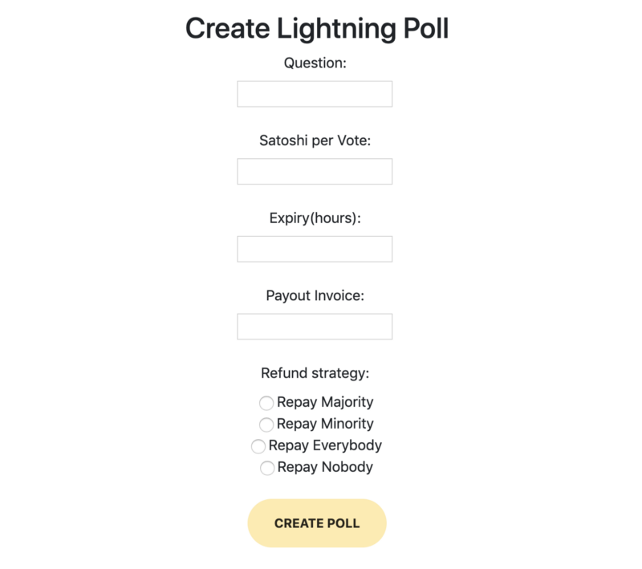

# Lightning Poll

**What inspired you to build Lightning Poll?**  
  
I think that the Lightning Network is fascinating because it addresses some of the pain points associated with on chain transactions, without compromising the trustless nature of Bitcoin. The most apparent strength of the Lightning Network is micropayments, as many of the projects at Boltathon illustrated. I have been following the HODL invoices pull request for a while, because I think that the ease of refund they provide is another significant on chain pain point which lightning addresses. Pairing micropayments and easy refunds is exciting to me because it opens up possibilities which were previously unfeasible, and I wanted to explore ways in which this functionality could be used.   
  
**In three sentences or less, tell us about your project.**  
  
Lightning poll is a twist on the traditional votes-for-sats concept. Users can create polls with a refund strategy which refunds a certain set of users depending on the outcome of the vote. The hackathon theme was "hack social interaction", which lightning poll aligns with in the use case where content producers ask their followers what content they would like to see next, earn some sats from the majority vote and refund the voters whose choice doesn't get produced.   
  
**How did you build Lightning Poll?**   
  
Lightning poll is written in Golang, using a web framework called Gin and GOnic. I built LND with the HODL invoices tag, and used it to create refundable invoices for votes. I decided against using traditional login, because it is an annoying barrier when you're doing something as simple as creating a poll. Instead, a zero invoice \(which can be settled with any amount\) is required to create a poll, because we do not know how much will be paid out to the creator until after the poll is closed and users are refunded.  
  
**What were the biggest development challenges?**  
  
HODL invoices in LND are a new feature, and do not fit into the existing API. I assumed that they would be, and ended up having to backtrack a fair amount when I realised that they use a separate, and differently setup, set of endpoints.   
  
**What are your plans for the project post hackathon?**  
  
I am planning on launching lightning poll on mainnet. I have synced up a bitcoind and LND node, so just need to find the time to un-hack some of the more hacakthon-esque parts of lightning poll's code and then it will be up and running.   
  
**What daemon features are you most excited about?**  
  
I'm pretty excited for AMP, because I think it will really improve routing of bigger payments. Conner Fromknecht's Botlathon talk about watchtowers was also very exciting, because it opens up opportunities for mobile lightning apps, which I think are going to be a big part of driving the success of lightning.   
  
**What projects are you most excited about this next year?**  
  
I have been accepted into the Chaincode Bitcoin and Lightning Summer Residency, where we will have the opportunity to work on mentored projects contributing to Bitcoin Core or LND. I am going to look into extracting the signer interface from LND so that your private keys can sit separately from your LND node, which I am very excited about. 

**Hacking HODL invoices at \#Bothathon 2019** [https://medium.com/@kirkcohenc/hacking-hodl-invoices-at-bothathon-2019-7c540ccfa1ee](https://medium.com/@kirkcohenc/hacking-hodl-invoices-at-bothathon-2019-7c540ccfa1ee)

