# Lightning at Home

### Overview

This guide will explain how to set up a working Lightning Network node at home, consisting of Bitcoin Core \(mainnet\) and [Lightning Network Daemon](lnd.md) \(LND\). Running a Lightning Network node \(such as LND\) requires a [backend blockchain watcher](lnd.md#chainwatcher-backends) \(such as Bitcoin Core\) in order to see what on-chain transactions are occurring. The second half of this guide shows how to connect the two, as well as add the [Zap Desktop](../wallets/zap-desktop.md) graphical user interface to your node.

We've included specific details for each step, with the assumption that users are not completely comfortable with using the CLI \(Command Line Interface\). Given the stage of the network, creating a local, secure Lightning Network node will require a small amount of CLI interaction. 

The Bitcoin blockchain is large and continues to grow, so we recommend at least 250 GB of free disk space. If you want to sync either Bitcoin Testnet or Litecoin you'll need [significantly less space](lnd.md#chainwatcher-backends). Downloading the blockchain is the longest part of the entire process \(anywhere from a few hours to a number of days\), while installing and connecting LND and Zap Desktop should take 10-20 minutes.

### Set up Bitcoin Core



When you download Bitcoin Core, you'll be prompted to review space requirements and specify a data directory \(where the blockchain is saved\). In this example we'll use the default directory.

* Linux: `~/.bitcoin`
* OSX `~/Library/Application\ Support/Bitcoin`
* Windows `C:\Users\<username>\AppData\Roaming\Bitcoin`

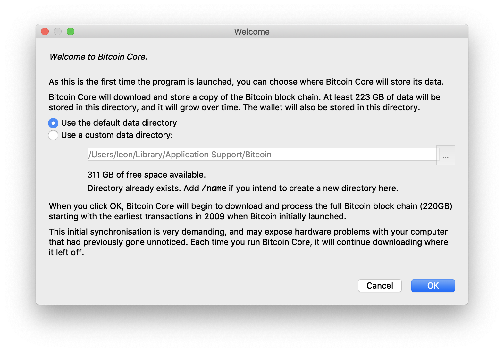

Start! You'll see this screen on startup below, and it can take some time to migrate to the status screen. Don't be discouraged if it hangs while working slowly in the background. You can always check debug.log to see the details.


Wait... Depending on your computer, internet connection, or external hard drive, this can take anywhere from a few hours to a week.


### Configure Bitcoin to work with LND

Running Bitcoin Core does not open certain connections for LND by default. Bitcoin Core uses a file called `bitcoin.conf` that contains settings that allow the software to talk with LND. For those familiar with editing `bitcoin.conf`here is what's needed:

```text
# server=1 tells bitcoind to accept JSON-RPC commands
server=1

# Enable publish raw block in <address>
zmqpubrawblock=tcp://127.0.0.1:28332

# Enable publish raw transaction in <address>
zmqpubrawtx=tcp://127.0.0.1:28333

# On client-side, you add the normal user/password pair to send commands:
rpcuser=rpcuser_here_844585

# change this password
rpcpassword=rpcpassword_here_12574
```

Another way is to download the bitcoin.conf provided below. You can open it in any text editor.



We have to ensure this configuration file is in the correct directory for Bitcoin Core to find it. Start by going to your bitcoin directory. 

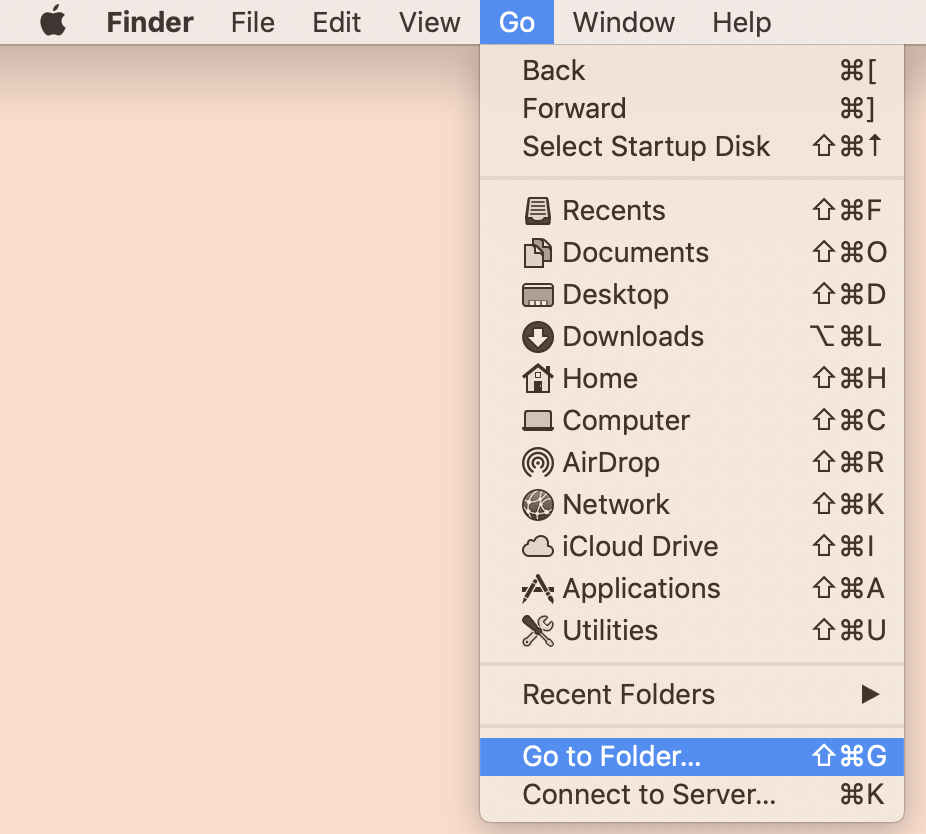

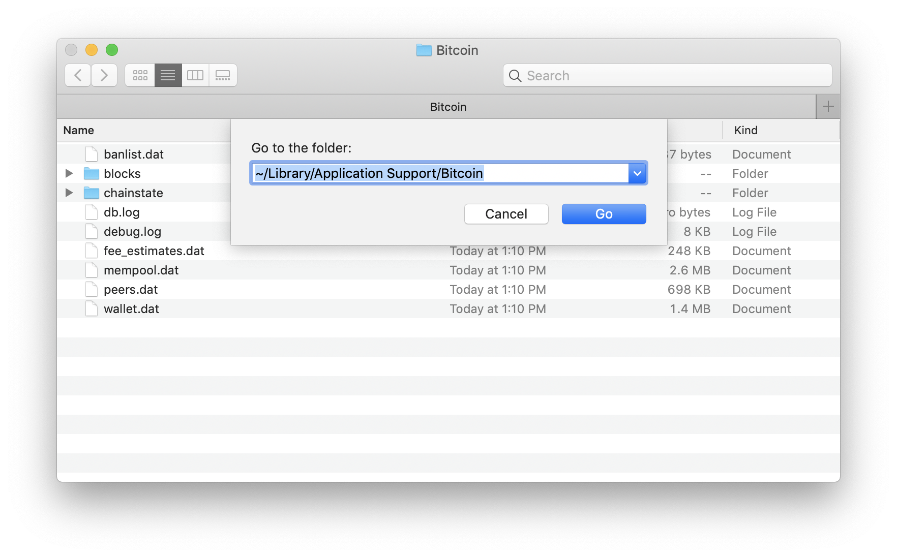

Add `bitcoin.conf` to that directory.

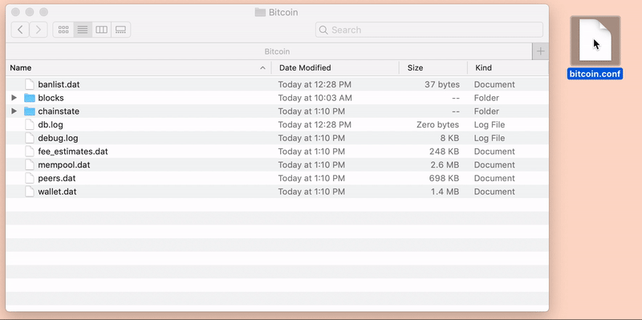

Restart Bitcoin Core. It should now be able to connect to LND once we have both running.

### Download LND

[LND](lnd.md), or the Lightning Network Daemon, is the software that interacts with other users on the Lightning Network. There are a few ways to install LND:

* From Releases: [https://github.com/lightningnetwork/lnd/releases](https://github.com/lightningnetwork/lnd/releases)
* From Source: [https://github.com/lightningnetwork/lnd/blob/master/docs/INSTALL.md](https://github.com/lightningnetwork/lnd/blob/master/docs/INSTALL.md)

In this example, we'll download the the latest release. Select the correct version for your operating system.

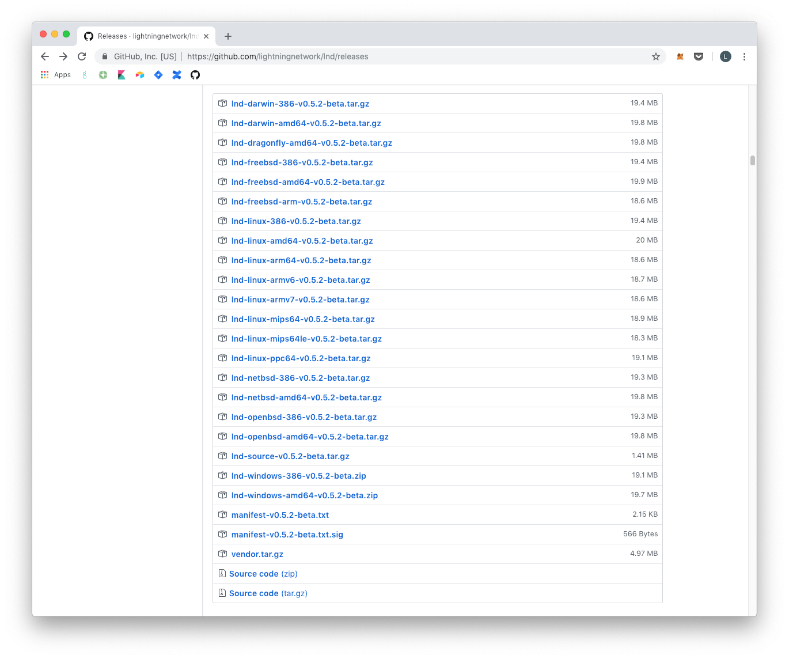

The download directory should include both `lnd` and `lncli`

* `lnd`: Runs the daemon
* `lncli`: Interacts with the daemon

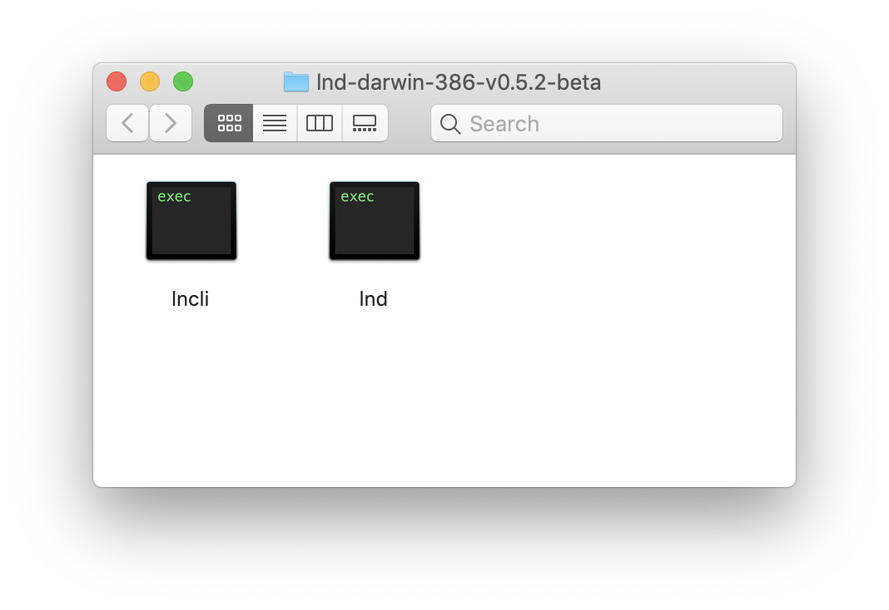

### Start LND

For those familiar with editing `lnd.conf`here is what's needed:

```text
bitcoin.active=1
bitcoin.mainnet=1
bitcoin.node=bitcoind
bitcoind.rpcuser=rpcuser_here_844585
bitcoind.rpcpass=rpcpassword_here_12574
bitcoind.zmqpubrawblock=tcp://127.0.0.1:28332
bitcoind.zmqpubrawtx=tcp://127.0.0.1:28333
```

Another way is to add it into the command used to run LND. This is where you'll have to step into the terminal for a brief moment.

* Make sure bitcoin core is running
* Open terminal
* Drag `lnd` into the terminal from your finder/explorer window
* Paste:`--bitcoin.active --bitcoin.mainnet --bitcoin.node=bitcoind --bitcoind.rpcuser=rpcuser_here_844585 --bitcoind.rpcpass=rpcpassword_here_12574 --bitcoind.zmqpubrawblock=tcp://127.0.0.1:28332 --bitcoind.zmqpubrawtx=tcp://127.0.0.1:28333`
* Press Enter
* Keep this terminal window open

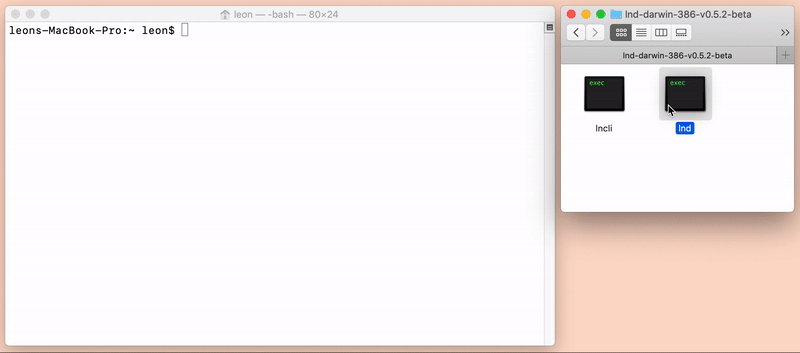

Here is a summary of what each of those flags mean:

* `--bitcoin.active` connects to the bitcoin chain \(instead of litecoin\)
* `--bitcoin.mainnet` connects to mainnet \(instead of testnet\)
* `--bitcoin.node=bitcoind` connects to the bitcoind backend
* `--bitcoind.rpcuser` is the rpc username in bitcoin.conf
* `--bitcoind.rpcpass` is the rpc password in bitcoin.conf
* `bitcoind.zmqpubrawblock=tcp://127.0.0.1:28332` is the socket which sends rawtx notifications from bitcoind
* `bitcoind.zmqpubrawblock=tcp://127.0.0.1:28333` is the socket which sends rawblock notifications from bitcoind

There should be a prompt that says:`Waiting for wallet encryption password. Use lncli create to create a wallet, lncli unlock to unlock an existing wallet, or lncli changepassword to change the password of an existing wallet and unlock it.`

### Create a Lightning Network wallet

Now you have LND up and running, it's time to set up a wallet.

* Open a new terminal window \(or new tab\).
* Drag `lncli` into the terminal. This lets the terminal know you're entering an LND command.
* Type `create` and press enter.
* Create a password. Your password must be at least 8 characters. Note that you won't see any of your password characters as you type them, but LND will ask you to confirm your password a second time.
* LND will ask if you have a passphrase. You can enter 'n' here, or enter a passphrase for extra security \(your password unlocks your wallet, whereas your passphrase is used for encryption and decryption\).
* Save your seed phrase! This is necessary for recovering your on-chain wallet if LND is lost or uninstalled.

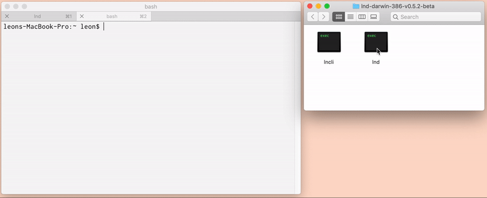

### Verify LND's connection

Once you've created your wallet we need to check that everything is working. We'll use a command called `getinfo` to see our node's information.

Run your first command!

* drag `lncli` into the terminal
* type `getinfo`

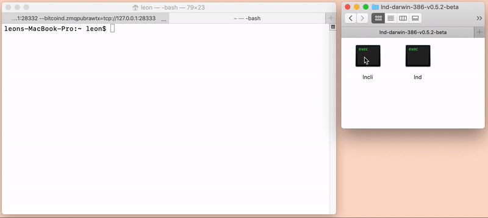

And you're off!

### Connect to Zap Desktop \(optional\)

If interacting through the command line interface is not your thing, then let's connect to [Zap Desktop ](https://wiki.ion.radar.tech/tutorials/wallets/zap-desktop). This will give you a functional GUI to check your on and off-chain balance, as well as your channels. 

Make sure `lnd` is running before connecting.

Download Zap wallet: [https://zap.jackmallers.com/](https://zap.jackmallers.com/)

Create a new wallet.

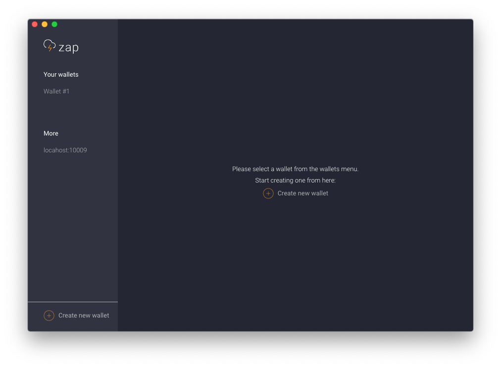

Connect your own node.

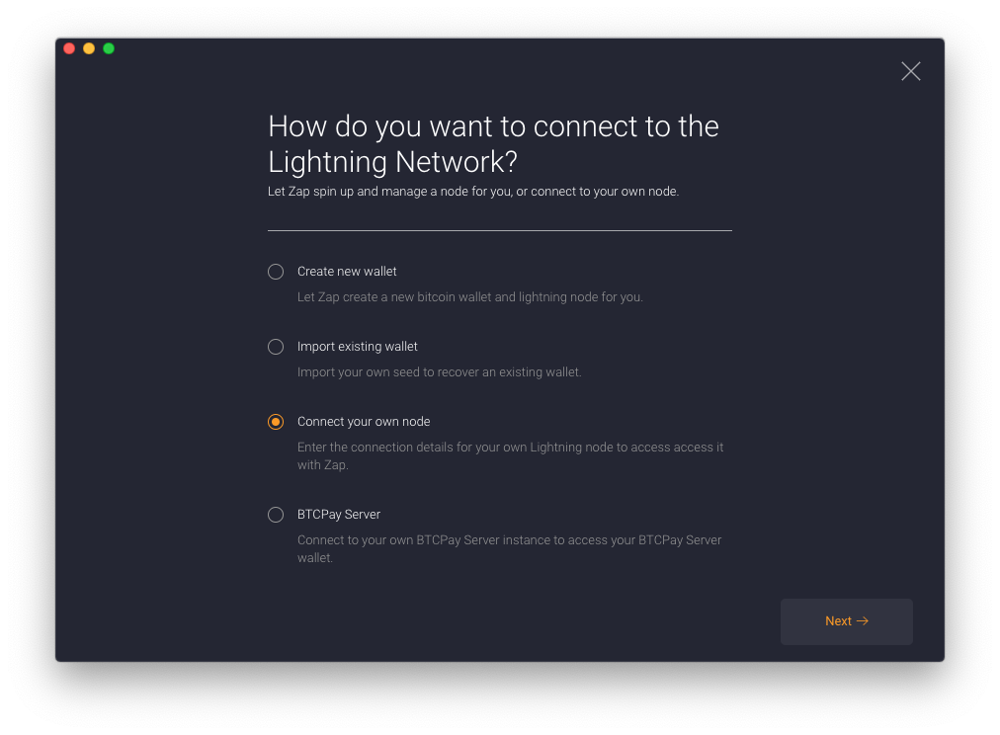

#### Connection details \(default\):

* Linux
  * Host: `localhost:10009`
  * TLS Certificate: `~/.lnd/tls.cert`
  * Macaroon: `~/.lnd/data/chain/bitcoin/mainnet/admin.macaroon`
* OSX
  * Host: `localhost:10009`
  * TLS Certificate: `~/Library/Application Support/Lnd/tls.cert`
  * Macaroon: `~/Library/Application Support/Lnd/data/chain/bitcoin/mainnet/admin.macaroon`
* Windows
  * Host: `localhost:10009`
  * TLS Certificate: `C:\Users\<username>\AppData\Roaming\Lnd\tls.cert`
  * Macaroon: `C:\Users\<username>\AppData\Roaming\Lnd\data\chain\bitcoin\mainnet\admin.macaroon`

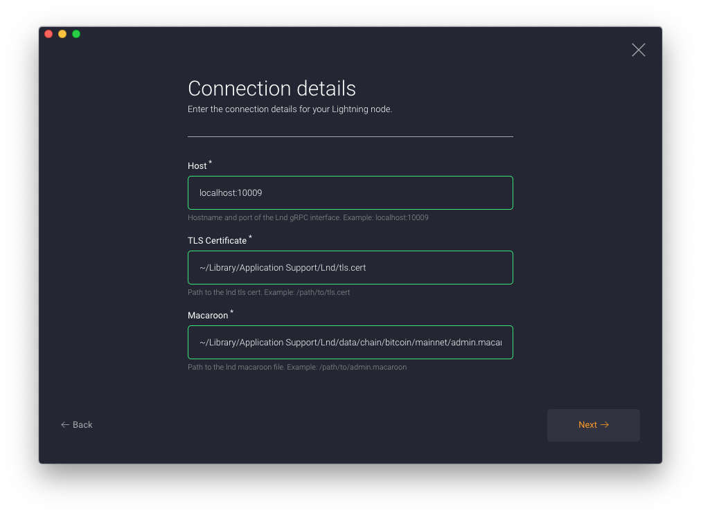

You're connected!

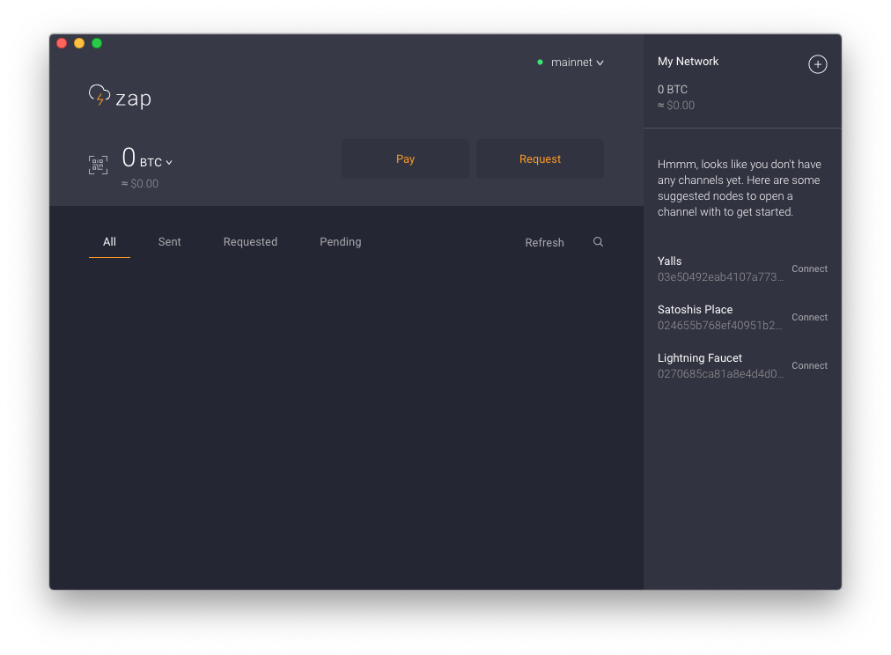

### Post Setup

Now you're wondering, "I ran through the installation process and got everything connected. What happens if I restart my computer?"

You'll have to make sure that you start both pieces of software again, and unlock your wallet.

* Start Bitcoin Core
* Start lnd
  * `lnd --bitcoin.active --bitcoin.mainnet --bitcoin.node=bitcoind --bitcoind.rpcuser=rpcuser_here_844585 --bitcoind.rpcpass=rpcpassword_here_12574 --bitcoind.zmqpubrawblock=tcp://127.0.0.1:28332 --bitcoind.zmqpubrawtx=tcp://127.0.0.1:28333`
* Unlock lnd
  * `lnd unlock`
  * or unlock with zap wallet

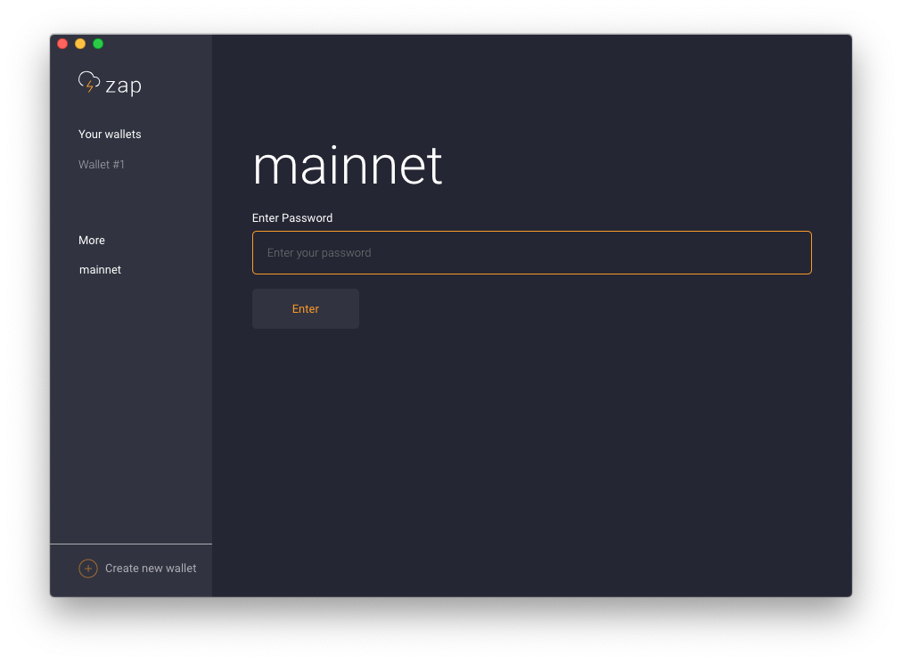

